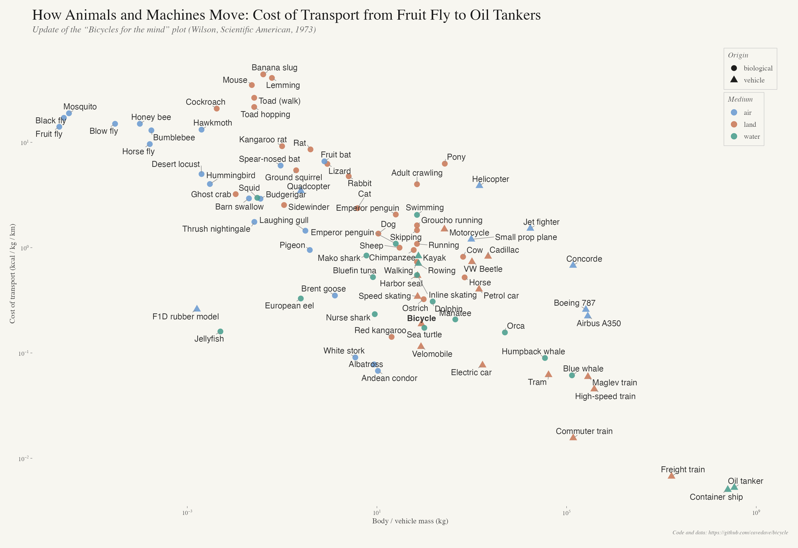
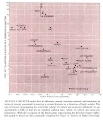

# Bicycle — cost of transport (animals and machines)

This repo holds the data and R code for a log–log plot of **metabolic and mechanical cost of transport** (kcal per kg per km) versus **body or vehicle mass** (kg), in the spirit of Tucker’s figure and Wilson’s *“bicycle for the mind”* article (*Scientific American*, 1973).

Data live in `tucker_1970_table1_cost_of_transport.csv`. Regenerate figures from the repo root with:

```bash
Rscript plot_quick.R
```

PNG outputs are written under `plots/`.

---

## 1. Full redact graph

Combined animals and vehicles, fruit-fly scale upward, with a curated subset of labels and points for clarity (`plot_quick.R` → `plots/full_redact.png`).



---

## 2. Original graph

Wilson-style reference image included in the repo for comparison.



---

## 3. Explainer (bicycle for the mind)

Background on the metaphor and why this kind of plot matters:

**[The computer is the bicycle of the mind](https://medium.com/@jennyabramov/the-computer-is-the-bicycle-of-the-mind-405c5242bcdb)** — Jenny Abramov (Medium)

---

## Repository

**Code and issues:** [github.com/cavedave/bicycle](https://github.com/cavedave/bicycle)
